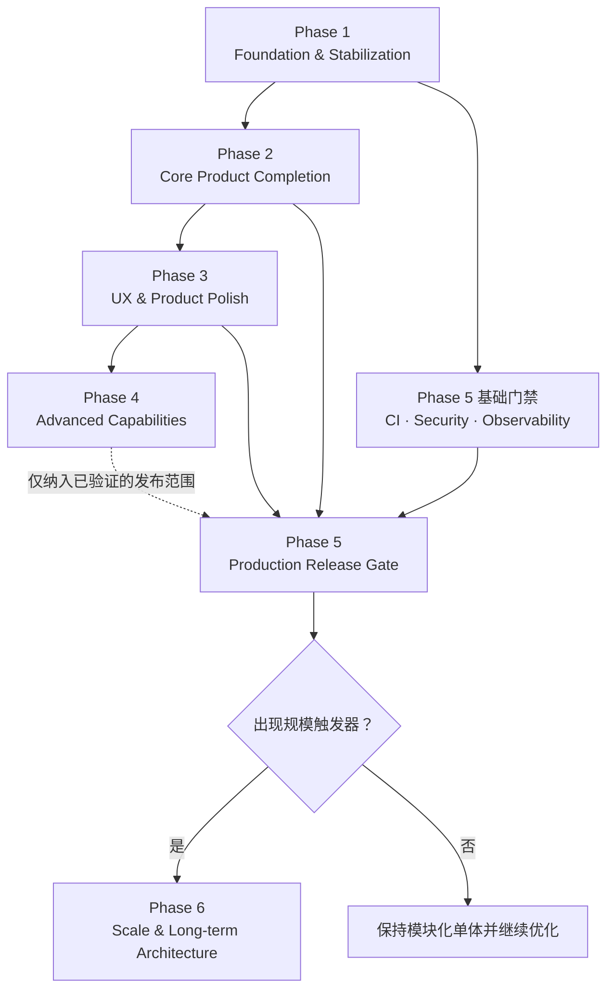

# Post-MVP Roadmap

> 基准日期：2026-08-15。路线图以代码审计为依据；状态更新规则见 [任务看板](../tasks/current-sprint.md)。
>
> **唯一前瞻路线图（2026-08 起）。** 历史执行清单（MVP 四阶段 + P1–P9，含 Timeline/Episode Render 等 alpha 任务）已归档至
> [codex-phase-roadmap（DONE，不再维护）](../alpha/design/codex-phase-roadmap-v0.1.md)；本文档为后续开发的唯一前瞻来源，
> 已落地的 P2–P9 能力（角色/地点/服装版本库、read model、provenance、prompt 版本、工作流注册表、Job DAG、Director 持久化与审批、
> 连续性引擎、Timeline、整集渲染）作为背景并入下表的 Phase/Epic 规划，横向状态以 [AGENTS.md](../../AGENTS.md) 为准。

## 全局视图

| Phase | Goal | Status | Priority | Epics |
|---|---|---|---|---|
| Phase 1 | Foundation & Stabilization | **Current** | P0 | 质量基线；数据与异步一致性；Agent 安全；契约与可诊断性；本地安全与 Adapter |
| Phase 2 | Core Product Completion | Planned | P0 | 可信规划；生命周期与资产；Director 审批/撤销；Provider 设置；版本生产流 |
| Phase 3 | UX & Product Polish | Planned | P1 | 反馈与恢复；信息架构；桌面效率；可访问性与感知性能 |
| Phase 4 | Advanced Capabilities | Planned | P1 | Continuity；Production Graph；视频与最小 Timeline；AI 质量评审 |
| Phase 5 | Production Readiness | Planned / foundation starts in P1 | P0 | 测试；桌面发行；安全；可观测性；备份与性能 |
| Phase 6 | Scale & Long-term Architecture | Future / trigger-based | P2 | 容量演进；分布式运行；存储/搜索；扩展与协作 |

## 阶段依赖

Phase 5 不是“最后才补测试”。最小 CI、安全边界和可诊断性从 Phase 1 开始；Phase 5 是安装、升级、恢复和真实用户发布的最终验收门槛。

## 阶段入口与出口

| Phase | Entry Gate | Exit Gate |
|---|---|---|
| 1 | MVP happy path 可重复 | P0 数据/边界风险关闭；核心任务可恢复；最小 CI 通过 |
| 2 | Phase 1 exit gate | 已审阅计划可确定提交；核心生命周期完整；Director 可审批/撤销 |
| 3 | 稳定 API/状态机 | 核心路径反馈一致；键盘与可访问性达桌面工具基线 |
| 4 | 核心产品和 UX 已验证 | 每项高级能力有用户价值指标、成本边界与可维护 Domain Contract |
| 5 | 发布范围冻结 | 安装、迁移、备份、回滚、安全、E2E、真实 Adapter 全部验收 |
| 6 | 明确容量/协作/扩展触发器 | 只解决已测得瓶颈，迁移可回滚，单机模式仍受支持 |

## 优先级规则

任务顺序按下列因素综合决定，而非按目录排列：

1. 是否阻塞其他工作；
2. 是否影响 Project State 正确性或安全；
3. 是否位于小说→分镜→生成→版本→Director 的核心路径；
4. 失败概率与影响范围；
5. 用户价值相对于实现和维护成本；
6. 能否用明确验收标准关闭风险。

Priority 定义：P0 阻塞/正确性/安全；P1 核心产品；P2 重要优化；P3 Nice-to-have。Complexity 仅使用 XS/S/M/L/XL，不代表工期承诺。

## Roadmap 文件

- [Phase 1 — Foundation & Stabilization](phase-1-foundation.md)
- [Phase 2 — Core Product Completion](phase-2-core-product.md)
- [Phase 3 — UX & Product Polish](phase-3-ux.md)
- [Phase 4 — Advanced Capabilities](phase-4-advanced.md)
- [Phase 5 — Production Readiness](phase-5-production.md)
- [Phase 6 — Scale & Long-term Architecture](phase-6-scale.md)
- [当前架构](../architecture/current-state.md) / [目标架构](../architecture/target-state.md)
- [Post-MVP 审计](../audits/post-mvp-audit.md)
- [Current Sprint](../tasks/current-sprint.md) / [Backlog](../tasks/backlog.md) / [Completed](../tasks/completed.md)

## 状态维护规则

1. Task 进入开发前，先从 Backlog 移入 Current Sprint，并确认 Dependencies 已满足。
2. API/DB/Event/Tool 变化先更新对应事实源文档，再实现。
3. Task 只有在 Acceptance Criteria 全部勾选、验证命令记录完成后才可进入 Completed。
4. 完成记录必须保留日期、Commit/PR 和简要变更；不以“代码已写”代替 DoD。
5. 新需求先判断属于现有 Epic、候选 Backlog 还是 Phase 6 触发器；禁止绕过优先级直接插入高级功能。
